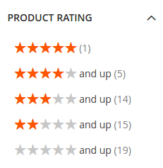

## ElasticSuite Ratings

This module is a plugin for [ElasticSuite](https://github.com/Smile-SA/elasticsuite).

It allows to display Magento2 user's ratings as a facet filter, and also as a sort order.

### Benefits

- You will see a new facet allowing to **filter on products average ratings**.




- You will also be able to use the ratings as a **sort order** in category pages and search results.


### Requirements

The module requires :

- [ElasticSuite](https://github.com/Smile-SA/elasticsuite) > 2.3.*

- Magento2 CE/EE Edition

### Quick Start Guide

1. Install the module via Composer :

``` composer require smile/module-elasticsuite-rating ```

2. Enable it

``` bin/magento module:enable Smile_ElasticsuiteRating ```

3. Install the module and rebuild the DI cache

``` bin/magento setup:upgrade ```

4. Process a full reindex of catalogsearch index to reindex the Ratings data

``` bin/magento index:reindex catalogsearch_fulltext ```


### How to use

The module is adding a new Product Attribute, called **ratings_summary**.

Since this is managed via an attribute, you are able to :

- display/hide it on category pages (via the __Is Filterable__ option)
- display/hide it on search pages (via the __Is Filterable In Search__ option)
- allow/disallow it for sort order (via the __Used for Sort By__ option)
